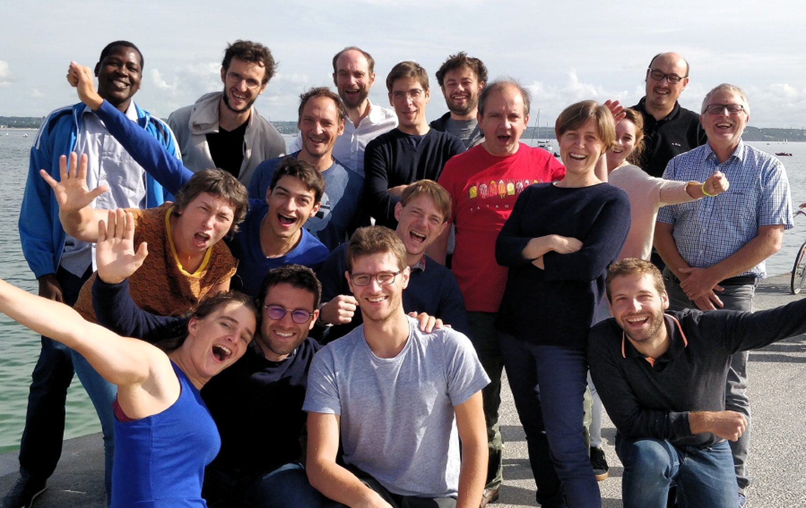

Ateliers Finist'R 2018
================

L'atelier Finist'R 2018 -- ou *bootcamp R* s'est tenu à Beg Meil du 27 au 31 août 2018. sont

Participants
------------

-   1er rang: Marie Perrot (UMR MIA Paris), Timothée Tabouy (UMR MIA Paris), Félix Cheysson (UMR MIA Paris), Mathieu Carmassi (UMR MIA Paris - EDF)
-   2ème rang: Marie-Pierre Étienne (IRMAR/ Agrocampus Ouest), Antoine Bichat (UMR Maiage - INRA), Julien Chiquet (UMR MIA Paris - INRA), Sophie Donnet (UMR MIA Paris - INRA),
-   3ème rang: Bewentaoré S. (UMR MIA Paris), Pierre Gloaguen (UMR MIA Paris - Agroparistech), Avner Bar-Hen (CNAM), Saint-Clair Chabert-Liddell (UMR MIA Paris), Vincent Runge (UMR LaMME - Université Paris Saclay), Jean-Baptiste Lecomte (UMR ESE - Agrocampus Ouest), Gabriel Lang (UMR MIA Paris - Agroparistech), Raphaëlle Momal (UMR MIA Paris), Pierre Navaro (IRMAR - Université de Rennes), Éric Parent (UMR MIA Paris - Agroparistech)

Programme
---------

### Atelier 1: scrapping

### Atelier 2: interfaces, calcul

### Atelier 3: bonnes pratiques de programmation

### Atelier 4: bases de données, SIG

| Horaire     | Lundi                                         | Mardi                     | Mercredi                                      | Jeudi                                       | Vendredi                |
|:------------|:----------------------------------------------|:--------------------------|:----------------------------------------------|:--------------------------------------------|:------------------------|
| 8h30-9h30   |                                               | Optimisation – J. Chiquet | Package – J. Chiquet                          | Base de données -MP Etienne                 | Bilan                   |
| 9h30-10h30  |                                               | Atelier 2 : R Interface   | Atelier 3 : bonnes pratiques de programmation | Atelier 4 : SIG et représentation graphique | Finalisation des rendus |
| 10h30-11h00 |                                               | Pause                     | Pause                                         | Pause                                       | Pause                   |
| 11h00-12h30 |                                               | Atelier 2 : R Interface   | Atelier 3 : bonnes pratiques de programmation | Atelier 4 : SIG et représentation graphique | Finalisation des rendus |
| 12h30-13h30 | Repas                                         | Repas                     | Repas                                         | Repas                                       | Repas                   |
| 13h30-14h30 | Introduction : Objectif, Organisation, Rendus | Atelier 2 : R Interface   | Atelier 3 : bonnes pratiques de programmation | Atelier 4 : SIG et représentation graphique |                         |
| 14h30-16h00 | Atelier 1 : Web scraping/ Textmining          | Atelier 2 : R Interface   | Atelier 3 : bonnes pratiques de programmation | Atelier 4 : SIG et représentation graphique |                         |
| 16h00-16h30 | Pause                                         | Pause                     | Pause                                         | Pause                                       |                         |
| 16h30-17h30 | Atelier 1 : Web scraping/ Textmining          | Atelier 2 : R Interface   | Atelier 3 : Point P. Navarro                  | Atelier 4 : SIG et représentation graphique |                         |
| 17h30-18h30 | Atelier 1 : Bilan                             | Atelier 2 : Bilan         | Atelier 3 : Bilan                             | Atelier 4 : Bilan                           |                         |
