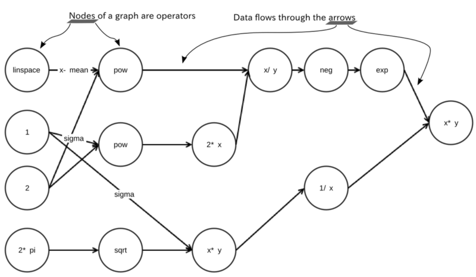

```{r setup, include=FALSE}
knitr::opts_chunk$set(echo = TRUE)
```

# Tensorflow en 3 mots

On cherche à comprendre le principe de fonctionnement de TensorFlow. TensorFlow est essentiellement connu comme l'optimiseur permettant d'ajuster le modèle d'apprentissage profond. Il est développé pour Google. Cependant, on peut espérer accéder aux fonctions de base afin d'optimiser n'importe quelle autre fonction (vraisemblance, moindres carrés pénalisés, etc.)

Afin d'ajuster un modèle, on utilise en général un algorithme de descente de gradient plus ou moins complexe (stochastique ou non, contraint ou non). 
Dans tous les cas, le point essentiel est d'être capable de calculer le gradient d'une fonction. 

La puissance de TensorFlow est de faire appel à la différenciation automatique. 
https://en.wikipedia.org/wiki/Automatic_differentiation

En quelques mots, si $f$ est la fonction d'intéret. La différenciation automatique décompose cette fonction en opérations simples (somme, produit, puissance, exponentielle...). Les dérivées partielles sont alors obtenues en appliquant la chain rule. 

Par exemple, on peut décomposer la densité de la gaussienne selon le schéma suivant: 




Plusieurs façons de calculer les dérivées patielles successives sont possibles : forward, backward 


# Comment utiliser la technique TensorFlow sur autre chose que des réseaux de neurones


Ici exemple depuis R : il faut avoir installé miniconda sur votre machine. 
Puis on installe le package  tensorflow dans R : ce package contient entre autre  un installeur de tensorflow (qui est une surcouche d'un code python)

```{r, eval=FALSE, echo = TRUE}
library(tensorflow)
install_tensorflow()
```
L'opération install_tensorflow() est longue et nécéssite une bonne connection. Mais elle marche (en générale, surtout sous Windows!) 

```{r, echo = TRUE}

library(tensorflow)

# Create 100 phony x, y data points, y = x * 0.1 + 0.3
x_data <- runif(100, min=0, max=1)
y_data <- x_data * 0.1 + 0.3 +rnorm(100,0,0.1)

# Try to find values for W and b that compute y_data = a * x_data + b
# figure that out for us.)
a <- tf$Variable(tf$zeros(shape(1L)))
b <- tf$Variable(tf$zeros(shape(1L)))
y <- a * x_data + b

# Minimize the mean squared errors.
loss <- tf$reduce_mean((y - y_data) ^ 2)
optimizer <- tf$train$GradientDescentOptimizer(0.5)
train <- optimizer$minimize(loss)

# Launch the graph and initialize the variables.
sess = tf$Session()
sess$run(tf$global_variables_initializer())

# Fit the line (Learns best fit is a: 0.1, b: 0.3)
for (step in 1:201) {
  sess$run(train)
  if (step %% 20 == 0)
    cat(step, "-", sess$run(a), sess$run(b), "\n")
}

```


Autre exemple  : trouver le mode d'une loi gamma

```{r, echo=TRUE}

alpha <- 3
beta <- 6

########################################


# définition des objets tf
x <- tf$Variable(tf$zeros(shape(1L)))
alpha.tf <- tf$constant(alpha)
beta.tf  <- tf$constant(beta)
gamma.func.tf <- -exp(x)^(alpha.tf - 1) * exp(-beta.tf * exp(x))

optimizer <- tf$train$GradientDescentOptimizer(0.5)
train <- optimizer$minimize(gamma.func.tf)


# descente de gradient
sess = tf$Session()
sess$run(tf$global_variables_initializer())
for (step in 1:201) {
  sess$run(train)
  if (step %% 20 == 0)
    cat(step, "-", sess$run(exp(x)), "\n")
}


```


Ce que j'aurais voulu faire en plus : récupérer juste la valeur du gradient en un $x$ donné : 
```{r, echo=TRUE, eval = FALSE}
var_grad <- tf$gradients(gamma.func.tf, x)
var_grad_val <- sess$run(var_grad,feed_dict = dict(x=1,convert=TRUE)) 
```

Faisable sous python mais pas réussi sous R? 


