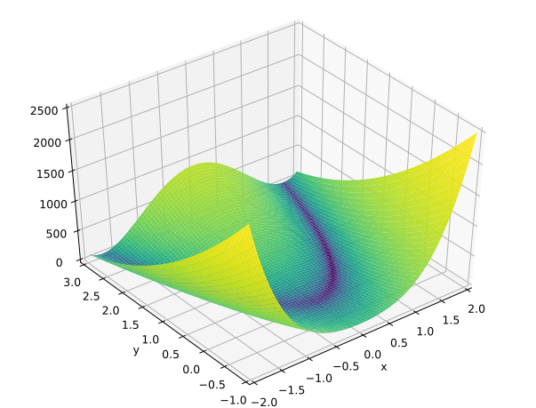

```{r setup, include = FALSE, cache = FALSE}
source(paste0(params$setup_path, "knitr_setup.R"))
```


## References

### See Chapter 9 in Convex Optimization [@convexOptim], [http://:web.stanford.edu/~boyd/cvxbook/](http://web.stanford.edu/~boyd/cvxbook/)

{width="50px"}\


### Online courses

All slides stolen (extracted/re-arranged) from \alert{Lieve Vandenberghe}:

  - Convex Optimization: [http://www.seas.ucla.edu/~vandenbe/ee236b/ee236b.html](http://www.seas.ucla.edu/~vandenbe/ee236b/ee236b.html)
  - Optimization Methods for Large-Scale Systems [http://www.seas.ucla.edu/~vandenbe/ee236c/ee236c.html](http://www.seas.ucla.edu/~vandenbe/ee236c/ee236c.html)


# Minimization Problem

## 

\includepdf[pages=1]{unconstrained_setup.pdf}

## 

\includepdf[pages=1]{descent_principle.pdf}

## 

\includepdf[pages=2]{descent_principle.pdf}

# Gradient methods

## 

\includepdf[pages=1]{gradient_method.pdf}

## 

\includepdf[pages=2]{gradient_method.pdf}

## 

\includepdf[pages=3]{gradient_method.pdf}


# Newton methods

## 

\includepdf[pages=1]{newton_method.pdf}

## 

\includepdf[pages=2]{newton_method.pdf}

## 

\includepdf[pages=3]{newton_method.pdf}

## 

\includepdf[pages=5]{newton_method.pdf}

# Quasi-Newton methods

## 

\includepdf[pages=1]{newton_quasi.pdf}

## 

\includepdf[pages=2]{newton_quasi.pdf}

## 

\includepdf[pages=3]{newton_quasi.pdf}

## 

\includepdf[pages=9]{newton_quasi.pdf}

# An example

## Rosenbrock Banana function

\[
  f(x) = 100( x_2 - x_2^2) + (1-x_1)^2
\]

\[
\nabla f (x) = \begin{pmatrix}
-400 x_1 (x_2 - x_1^2) - 2 (1-x_1) \\
200 (x_2 - x_1^2)
  \end{pmatrix}
\]

{width="200px"}\


## Rosenbrock Banana function in R

### objective
```{r objective rosenbrock}
objective <- function(x) {
  return( 100 * (x[2] - x[1] * x[1])^2 + (1 - x[1])^2 )
}

```

### gradient

```{r, gradient}
gradient <- function(x) {
  return( c( -400 * x[1] * (x[2] - x[1] * x[1]) - 2 * (1 - x[1]), 200 * (x[2] - x[1] * x[1]) ) )
}
```

# Use `stats::optim`

## `optim` usage

### Definition

```{r optim_syntax, eval = FALSE}
optim(par, fn, gr = NULL, ...,
      method = c("Nelder-Mead", "BFGS", "CG", "L-BFGS-B", "SANN",
                 "Brent"),
      lower = -Inf, upper = Inf,
      control = list(), hessian = FALSE)
```

  - Nelder-Mead: approximation of the gradient
  - BFGS: quasi-Newton
  - CG: conjuguate gradient
  - L-BFGS-B: BFGS with limited memory, box constrained
  - SANN: simulated annealing

## Call to optim - BFGS

```{r optim rosenbrock bfgs}
x0 <- c(-1.2, 1)
res_bfgs <- optim(x0, objective, gradient, method = "BFGS", control= list(trace = 2))
```

## Call to optim - CG

```{r optim rosenbrock cg}
x0 <- c(-1.2, 1)
res_cg <- optim(x0, objective, gradient, method = "CG", control= list(trace = 2))
```


# Use external library via `nloptr`

## `nloptr` usage

### Definition

```{r nloptr_syntax, eval = FALSE}
nloptr(x0, eval_f, eval_grad_f, ..., opts = list())
```

  - Many gradient free methods
  - Most existing gradient-based methods
  - global optimizer

## Call to `nloptr` - BFGS

```{r nloptr rosenbrock}
library(nloptr)
opts <- list("algorithm"="NLOPT_LD_LBFGS", "xtol_rel"=1.0e-8)
res <- nloptr(x0=x0, eval_f=objective, eval_grad_f=gradient, opts=opts)
print(res)
```

# Use external library by embedding C++ code by yourself

See [https://github.com/jchiquet/optimLibR](https://github.com/jchiquet/optimLibR)

## References

