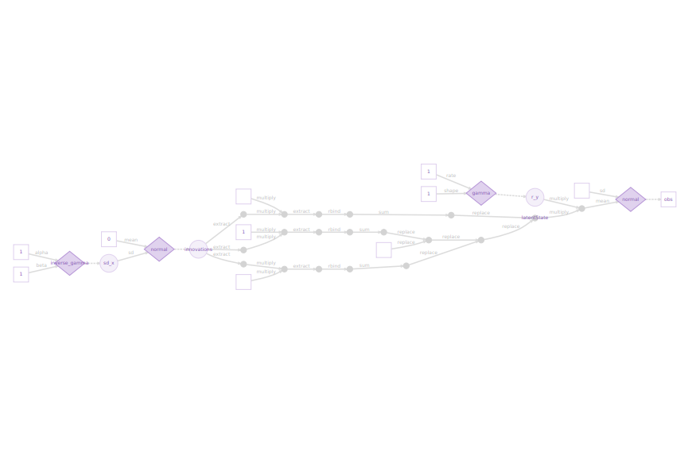
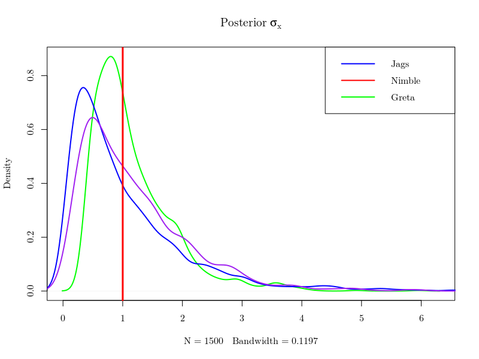
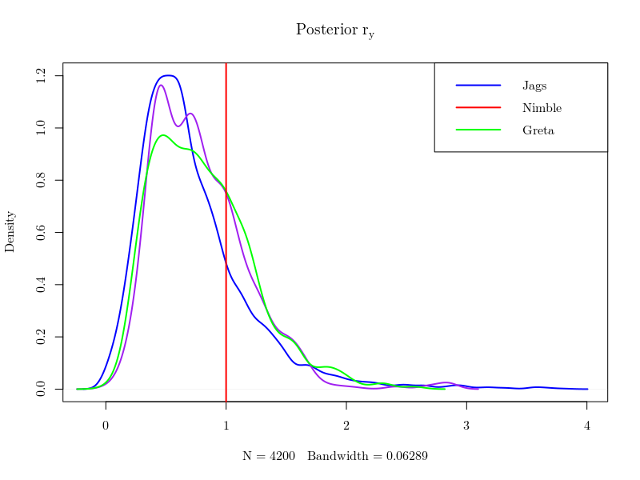
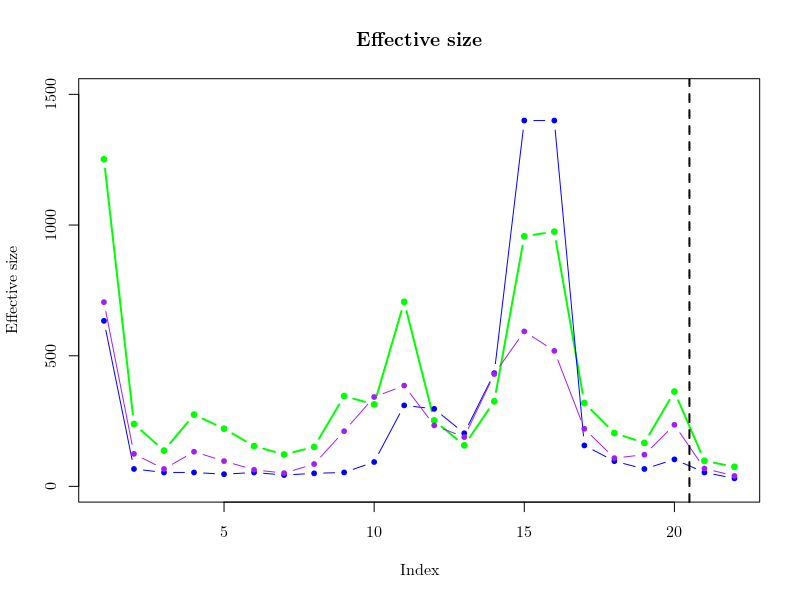

```{r setup, include=FALSE}
knitr::opts_chunk$set(echo = TRUE)
```

## Gaussian State Space model

$$X_{t} = \rho_x X_{t-1} + \epsilon_x \quad \text{with} \quad \epsilon_x \sim Normal(0, \sigma_x) $$

$$Y_{t} = \rho_y X_{t} + \epsilon_y \quad \text{with} \quad \epsilon_y \sim Normal(0, \sigma_y) $$


```{r packages, echo = FALSE, cache = FALSE, message = FALSE}
library(greta)
library(MASS)
library (bayesplot)
```

## greta definition from greta's website
simple : greta models are written right in R, so there’s no need to learn another language like BUGS or Stan

scalable : greta uses Google TensorFlow so it’s fast even on massive datasets, and runs on CPU clusters and GPUs

extensible : it’s easy to write your own R functions, modules, and even packages using greta

## Data simulation
```{r simulation}
set.seed(123)

## Données
N = 20; x_true = y = rep(NA,N);

sd_x_true = sd_y_true = 1
mean_x_init_true = 0
r_x_true = .85; r_y_true = 1

x_true[1] <- rnorm(1, mean_x_init_true, sd_x_true)

y[1] <- rnorm(1, r_y_true*x_true[1], sd_y_true)

for (t in 2:N){
  x_true[t] <- rnorm(1, r_x_true*x_true[t-1], sd_x_true)
  y[t] <- rnorm(1, r_y_true*x_true[t], sd_y_true)
}
```

## greta data and priors


```{r greta1}

# greta's data 
obs <- as_data(y)

# variables and priors
sd_y <- sd_y_true
r_y <- gamma(1, 1)

sd_x <- inverse_gamma(1, 1)
r_x <- r_x_true

innovations <- normal(0, sd_x, dim = N)
print(innovations)
```

```{r greta1b}

# greta's data 
obs <- as_data(y)

# variables and priors
sd_y <- sd_y_true
r_y <- gamma(1, 1)

sd_x <- inverse_gamma(1, 1)
r_x <- r_x_true

innovations <- normal(0, sd_x, dim = N)

latentState <- greta_array(data = 0, dim = c(N, 1))
for(t in 1:N){
  latentState[t, 1] <- sum(r_x^((t - 1) - (0:(t-1))) * innovations[1:t, 1])
}
```

## greta model definition
```{r greta2}
distribution(obs) <- normal(latentState * r_y, rep(sd_y, N), dim = N)
model_greta <- model(latentState, r_y, sd_x, precision = 'double')
```


## greta model DAG
```{r greta3, eval = FALSE}
plot(model_greta)
```



## greta model DAG
```{r greta4a, echo = FALSE, eval = TRUE, include = FALSE}
if(file.exists('greta_draws.RData')){
} else {
  draws <- mcmc(model_greta, n_samples = 1000)
  save(draws, file = 'greta_draws.RData')
}
```

```{r greta4, echo = TRUE, eval = FALSE}
draws <- mcmc(model_greta, n_samples = 1000)
```

## greta model DAG
```{r greta6, echo = TRUE, include = FALSE, eval = TRUE}
load('greta_draws.RData')
```


```{r greta7}
mcmc_trace(draws)
# mcmc_intervals(draws)
```


```{r greta7b, eval = TRUE, message = FALSE}
library(tidyverse)
nlignes <- nrow(draws[[1]])
bounds <- as_tibble(t(apply(draws[[1]][, -c(21, 22)],2,function(x) quantile(x,c(0.025,0.5,0.975)))))
bounds$param <- 1:N
colnames(bounds)[1:3] <- c("min","med","max")

ggdraws <- as_tibble(draws[[1]][, -c(21, 22)]) %>%
  gather(param, value) %>%
  mutate(param = as.numeric(str_extract(param, "[0-9]+")))

true <- as_tibble(data.frame(X=x_true,param=1:20))
obs <- as_tibble(data.frame(Y=y,param=1:20))
data <- left_join(ggdraws,bounds,by="param")
data <- left_join(data,true,by="param")
data <- left_join(data,obs,by="param")


ggplot(data,aes(param,value))+
  geom_point(size=0.2)+
  geom_ribbon(aes(ymin=min,ymax=max),fill="gold",alpha=0.2)+
  geom_line(aes(param,X,colour="col1"),size=1)+
  geom_line(aes(param,Y,colour="col2"),size=0.6, linetype="dashed")+
  geom_line(aes(param,med,colour="col3"),size=1.1)+
  scale_colour_manual(name = "",
                      values = c(col1 = "blue",col2 = "black",col3 = "violetred3"),
                      labels = c("True","Observed","Median estimate"))+
  labs (x="Time",y="Simulated values")+
  theme_bw()
```


## Comparison with nimble and jags






## Reference 
[https://greta-dev.github.io/greta/index.html](https://greta-dev.github.io/greta/index.html)