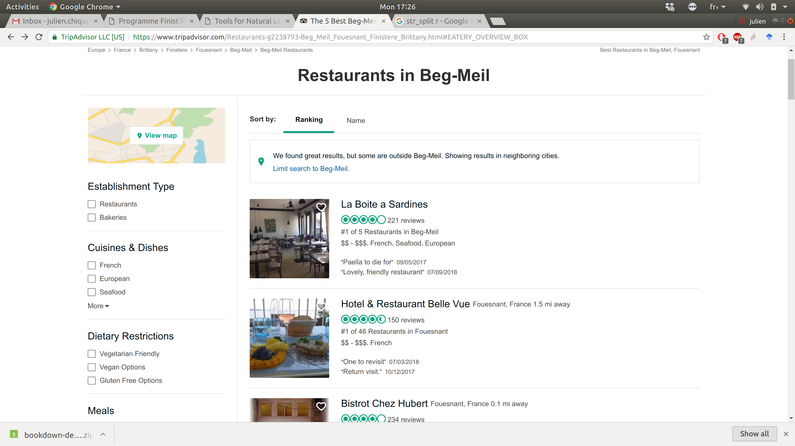
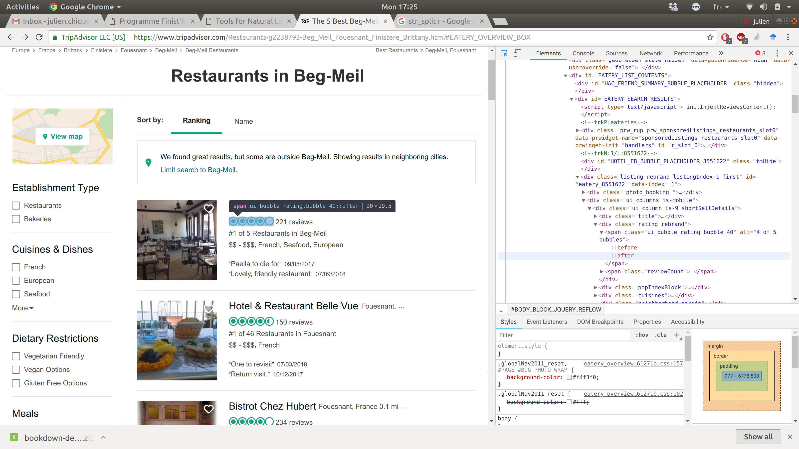

```{r setup, include=FALSE}
knitr::opts_chunk$set(echo = TRUE, comment = NA, cache = TRUE)
```

## Objectif

- Importer des données géographiques dans R;
- Liste des restaurants TripAdvisor pour la recherche *Beg Meil*;
- Utilisation du package *rvest*;
- Utilisation de quelques packages pour la manipulation de chaîne de caractères;

## Packages

```{r, requiredPackages}
rm(list = ls())# Bonne pratique
library(rvest)# Pour la lecture des pages HTML
library(parallel)# Pour paralléliser les traitements (c'est long!)
library(stringr)
library(qdapRegex)# Manip de chaîne de caractère
library(ggmap)# Pour le résultat final
```

## Notre cible



## Accès aux noms
```{r, AccesNom}
url <- "https://www.tripadvisor.fr/Restaurants-g2238793-Beg_Meil_Fouesnant_Finistere_Brittany.html"
webpage <- read_html(url)#Lecture de la page html
nomRestau <- webpage %>% #Argument principal
  html_nodes("a.property_title") %>% # Se rendre sur la balise adéquate
  html_text()# obtention du texte d'intérêt de la balise
#    str_remove_all(pattern = "\n")# mise en forme optionnelle
```

## Utilisation de l'explorateur

- *Ctrl+U
- *Clic droit -> Examiner l'élément



## Accès aux notes

```{r}
charNotes <- webpage %>% 
  html_nodes("span.ui_bubble_rating") %>%
  html_attr("alt")
# Equivalent de str_remove
notes <- sapply(strsplit(gsub(",", ".", charNotes), " "), function(x) as.numeric(x[1]))
nR <- length(nomRestau)# Tous les retaus ne sont pas notés..
notes <- c(notes, rep(NA, nR - length(notes)))# Première approximation
```

## Accès aux coordonnées

- Les coordonnées ne sont disponibles que sur les sous pages spécifiques
- Accès au lien vers ces sous pages:

```{r}
hyperRef <- webpage %>% 
  html_nodes("a.property_title") %>%
  html_attr("href")# Obtention d'un attribut
```

## Recolte des coordonnées

```{r, accesCoordonnees}
coords <- do.call(rbind, mclapply(hyperRef, function(url){
  subpage <- read_html(paste0("https://www.tripadvisor.fr", url))
  # Ici, c'est un enfer
  # Après fouille et discussion:
  # Accees a un gros bloc cible
  scriptInfo <-  subpage %>% 
    html_nodes("script")
  # Acces au sous bloc contenant la latitude
  toCheck <- which(grepl("lat:", scriptInfo))
  myLine <- as.character(scriptInfo[toCheck])
  # Extraction brute de force et laide
  lat <- as.numeric(rm_between(myLine, '\nlat:', ',', extract=TRUE)[[1]])
  long <- as.numeric(rm_between(myLine, '\nlng:', ',', extract=TRUE)[[1]])
  c(long = long, lat = lat)
}, mc.cores = detectCores()))
output <- data.frame(Restau = nomRestau, Note = notes, data.frame(coords))
head(output)
```

## Problème d'affichage par liste

- Fouille de la page pour obtenir les pages suivantes
```{r, AccesSousPages}
mainName <- "https://www.tripadvisor.fr/Restaurants-g2238793-Beg_Meil_Fouesnant_Finistere_Brittany.html"
mainPage <- read_html(mainName)
nombresPages <- mainPage %>%
  html_node("div.pageNumbers")%>%
  html_nodes("a") %>%
  length() + 1
dataOffset <- mainPage %>%
  html_node("div.pageNumbers")%>%
  html_node("a") %>%
  html_attr("data-offset") %>%
  as.numeric()
allWebPages <- sapply(seq(0, (nombresPages - 1) * dataOffset, by = dataOffset),
                      function(i){
                        if(i == 0)
                          return(mainName)
                        paste0("https://www.tripadvisor.fr/Restaurants-g2238793-",
                               "oa", i,
                               "-Beg_Meil_Fouesnant_Finistere_Brittany.html")
                      })
```

```{r, fonctionFinale, cache = T}
library(parallel)# Pour paralléliser les traitements (c'est long!)
myFinalData <- do.call(rbind.data.frame, lapply(allWebPages, function(url){
  webpage <- read_html(url)#Lecture de la page html
  nomRestau <- webpage %>% #Argument principal
    html_nodes("a.property_title") %>% # Se rendre sur la balise adéquate
    html_text()# obtention du texte d'intérêt de la balise
  #    str_remove_all(pattern = "\n")# mise en forme optionnelle
  hyperRef <- webpage %>% 
    html_nodes("a.property_title") %>%
    html_attr("href")
  charNotes <- webpage %>% 
    html_nodes("span.ui_bubble_rating") %>%
    html_attr("alt")
  # Equivalent de str_remove
  notes <- sapply(strsplit(gsub(",", ".", charNotes), " "), function(x) as.numeric(x[1]))
  nR <- length(nomRestau)# Tous les retaus ne sont pas notés..
  notes <- c(notes, rep(NA, nR - length(notes)))# Première approximation
  coords <- do.call(rbind, mclapply(hyperRef, function(url){
    subpage <- read_html(paste0("https://www.tripadvisor.fr", url))
    scriptInfo <-  subpage %>% 
      html_nodes("script")
    toCheck <- which(grepl("lat:", scriptInfo))
    myLine <- as.character(scriptInfo[toCheck])
    lat <- as.numeric(rm_between(myLine, '\nlat:', ',', extract=TRUE)[[1]])
    long <- as.numeric(rm_between(myLine, '\nlng:', ',', extract=TRUE)[[1]])
    c(long = long, lat = lat)
  }, mc.cores = detectCores()))
  data.frame(Restau = sapply(strsplit(nomRestau, "\n"), function(x) paste(x, collapse ="")),
             Note = notes, data.frame(coords))
}))
```

## Obtention d'un objet R au bon format

```{r}
head(myFinalData)
begMeil = c(lat = 47.863843, lon = -3.9852351)
myMap = get_map(location=begMeil,zoom=12)
ggmap(myMap) + geom_point(data=myFinalData, aes(x=long, y=lat),size=1)
```

