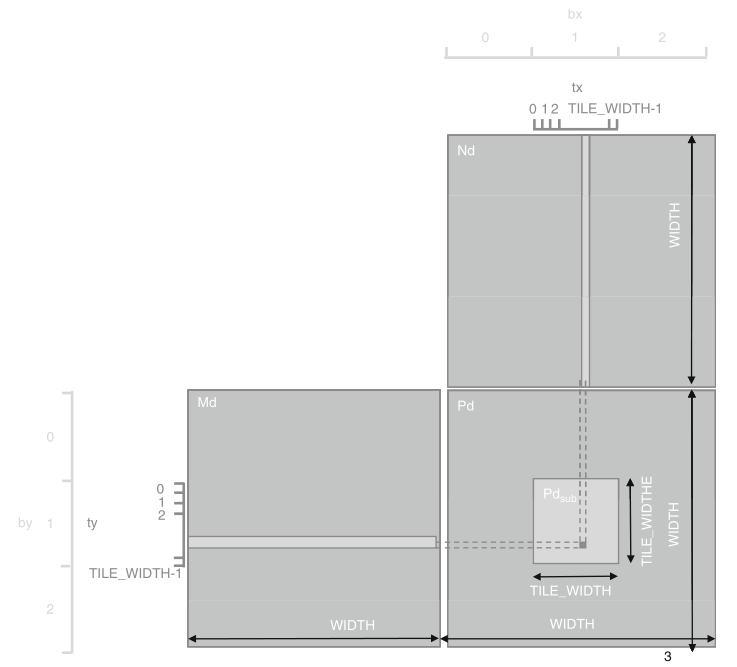

```{r setup, include=FALSE}
knitr::opts_chunk$set(echo = TRUE)
```

## CPU versu GPU

Le CPU (Central Processing Unit) est un microprocesseur chargé d'exécuter les instructions des programmes informatiques. Il fonctionne séquentiellement, exécutant les instructions les unes à la suite des autres (aujourd'hui, un coeur CPU fonctionne entre 2 et 4 GHz, c'est-à-dire exécute entre 2x10^9^ et 4x10^9^ opérations par seconde). Les ordinateurs modernes possèdent des CPUs multi-coeurs, chaque coeur étant un microprocesseur pouvant fonctionner indépendamment des autres. En général, 2 à 4 coeurs sont présents, permettant d'exécuter autant d'instructions en parallèle. Sous Windows, l'utilisation de ces coeurs peut être visualisé par le moniteur de performances (Gestionnaire de tâches [Ctrl + Maj + Echap] > onglet Performances > Ouvrir le moniteur de ressources > onglet CPU).


Les GPU (Graphics Processing Unit, souvent appelés cartes graphiques) ont été initialement développés pour traiter l'information contenues dans les images : pour générer plus de 60 images par seconde, à raison de plusieurs millions de pixels par image, le CPU ne peut pas traiter l'information suffisamment rapidement. Ces GPUs intègrent énormément de coeurs (plusieurs centaines, voire plusieurs milliers), pouvant tous fonctionner en parallèle indépendamment les uns des autres. Bien que chacun de ces coeurs soit moins performant que les coeurs du CPU (1 GHz pour les cartes graphiques modernes), la parallélisation massive des instructions permet d'accélérer grandement les codes adaptés.


## CUDA, qu'est-ce ?

CUDA (Compute Unified Device Architecture) est une plateforme de développement créée par NVidia permettant d'utiliser le GPU pour exécuter du code à la place du CPU. Les librairies disponibles permettent en particulier d'intégrer aisément les fonctions de l'API CUDA à du code C ou C++. En particulier, CUDA peut être interfacé à R afin de bénéficier des perfomances computationnelles du GPU.


Il existe des librairies R pour utiliser le GPU (par exemple `gpuR`). Ces librairies sont cependant relativement limitées, puisqu'elles implémentent un certain nombre de fonctions faisant appel au GPU mais ne permettent pas d'en développer de nouvelles. L'exception est RCUDA, qui permet d'écrire du code CUDA directement sous R. Nous nous intéresserons ici à l'interface via développement sous C (correspondant à la deuxième colonne sur le schéma ci-dessus). 

Attention : CUDA nécessite une carte graphique NVidia ! Ce n'est pas nécessaire de continuer sans.

## Installation de CUDA

Cette partie concerne uniquement les utilisateurs de Windows. Les utilisateurs de Linux peuvent installer RCUDA et profiter de CUDA sans avoir à sortir de RStudio.

L'installation de CUDA sous Windows est légèrement complexe. Heureusement, les développeurs de NVidia ont été suffisamment gentils pour fournir un tutoriel.
Je vous invite à vous référer à l'appendice du lien suivant : https://devblogs.nvidia.com/accelerate-r-applications-cuda/ pour l'installation, puis à ce blogpost http://www.ademiller.com/blogs/tech/2010/10/visual-studio-2010-adding-intellisense-support-for-cuda-c/ pour ajouter le support Intellisense de CUDA à C (pour éviter que Visual Studio détecte des erreurs de syntaxe).

## Architecture CUDA du GPU

Un programme CUDA est composé de code destiné à être exécuté soit sur le CPU (appelé système _hôte_), soit sur le GPU. Les fonctions parallélisables à exécuter sur le GPU, appelées _kernels_, génèrent un grand nombre de _threads_, i.e. les éléments de base qu'il faut exécuter, organisés en _blocs_. Tous ces threads générés par le kernel sont collectivement appelés _grille_. Chaque thread exécute ensuite le même code, indépendamment des autres threads.

Dans la grille, les threads sont organisées selon une hiérarchie à deux niveaux, comme illustré sur la figure ci-dessous. Au premier niveau, la grille est composé de blocs, organisés en tableau de dimension 2. Sur la figure, la grille 1 est organisée en un tableau 2x2 de 4 blocs. Les blocs sont ensuite composées de threads, organisés en tableau de dimension 3. Sur la figure, le bloc (1, 1) est composé de 16 threads organisés en tableau 4x2x2. Tous les blocs d'une grille doivent avoir le même nombre de threads et la même organisation. Par ailleurs, il ne peut y avoir plus de 1024 threads par bloc (ceci est une limitation hardware, et peut dépendre de la carte graphique, les anciennes étant limitées à 512 threads par bloc, et peut-être les futures à 2048 ou davantage ?).

Comme chaque thread exécute le même code, leur identification est nécessaire pour leur permettre d'accéder à des éléments mémoire différents. Ainsi, chaque bloc est identifié par les mots clé `blockIdx.x` et `blockIdx.y` et chaque thread par `threadIdx.x`, `threadIdx.y` et `threadIdx.z`.

<center>


</center>

## Structure d'un code CUDA

Nous pouvons enfin nous intéresser à la syntaxe. Voici un code CUDA permettant de multiplier deux matrices carrées :

```{c eval=FALSE}
/* CUDA API header files*/
#include "cuda.h"
#include "cuda_runtime.h"
#include "device_launch_parameters.h"

__global__ void
matrixMult(const double *Md, const double *Nd, double *Pd, int size)
{
	int row = blockDim.x * blockIdx.x + threadIdx.x;
	int col = blockDim.y * blockIdx.y + threadIdx.y;

	if (row < size) {	// Don't do anything to the memory if we're above the size of the matrix
		if (col < size) {
			
			double Pvalue = 0;
			for (int k = 0; k < size; k++) {	
				// Elements of 2d-arrays are stored in column-major ordering (i.e. column by column)
				// This is a consequence of this code being called in R (where column-major ordering is the norm)
				// whereas C usually stores 2d-array in row-major ordering
				Pvalue += Md[k*size + row] * Nd[col*size + k];
			}
			Pd[col*size + row] = Pvalue;
			
		}
	}
}

extern "C" __declspec(dllexport)
void gmatrixMult(double *M, double *N, double *P, int *size)
{
	int memSize = *size * *size * sizeof(double);
	// Device Memory
	double *Md, *Nd, *Pd;
	// Define the execution configuration
	dim3 blockSize(32, 32, 1);
	dim3 gridSize(1, 1, 1);
	gridSize.x = (*size + blockSize.x - 1) / blockSize.x;
	gridSize.y = (*size + blockSize.y - 1) / blockSize.y;
	// Allocate output array
	cudaMalloc((void**)&Md, memSize);
	cudaMalloc((void**)&Nd, memSize);
	cudaMalloc((void**)&Pd, memSize);
	// copy data to device
	cudaMemcpy(Md, M, memSize, cudaMemcpyHostToDevice);
	cudaMemcpy(Nd, N, memSize, cudaMemcpyHostToDevice);
	// GPU matrix multiplication
	matrixMult<<<gridSize, blockSize>>>(Md, Nd, Pd, *size);
	// Copy output
	cudaMemcpy(P, Pd, memSize, cudaMemcpyDeviceToHost);
	cudaFree(Md);
	cudaFree(Nd);
	cudaFree(Pd);
}
```

Le code CUDA est décomposé en deux parties : la fonction `gmatrixMult` qui sera appelée par l'utilisateur, repérée par la balise `extern "C" __declspec(dllexport)` qui spécifie au compilateur C NVidia `nvcc` quelle fonction sera exportée et donc accessible par l'utilisateur sous R; et le kernel `matrixMult`, qui est le code exécuté par tous les threads.

### Fonction interface`gmatrixMult`

Avant toute chose, cette fonction interface entre R et C doit respecter un certain nombre de propriétés :

1. Les fonctions C qui seront appelées dans R doivent avoir un type pour `return` de classe `void`, et doivent donc retourner les résultats à travers les arguments de la fonction. Ici, la matrice `P` en argument est en réalité celle qui sera retournée après multiplication de `M` et `N`.
2. R passe ses arguments par référence à C (e.g. `int *size`), et il faudra donc déréférencer systématiquement les pointeurs (`*size`).

Comme l'hôte et le GPU disposent de leur propre mémoire, une séquence typique d'instructions pour la fonction CUDA C exportée est la suivante :

1. Déclarer et allouer la mémoire GPU;
2. Transférer les données de l'hôte vers le GPU;
3. Appeler et exécuter les kernels;
4. Transférer les résultats du GPU vers l'hôte.

```{c eval=FALSE}
  // Device Memory
	double *Md, *Nd, *Pd;
	
  [...]
	
  // Allocate output array
	cudaMalloc((void**)&Md, memSize);
	cudaMalloc((void**)&Nd, memSize);
	cudaMalloc((void**)&Pd, memSize);
	
	[...]
	
	cudaFree(Md);
	cudaFree(Nd);
	cudaFree(Pd);
```

Les pointeurs `Md`, `Nd` et `Pd` vont pointer vers des emplacements mémoire dans la mémoire GPU.
Ces espaces mémoire sont alloués avec la fonction `cudaMalloc`, qui récupère l'adresse du pointeur spécifié en premier argument, et alloue la taille spécifiée par le deuxième argument (ici, taille mémoire d'une matrice de `double`). Désormais, `Md` est un pointeur qui pointe vers un espace mémoire du GPU de taille suffisante pour accueillir une matrice de `double` de taille `size*size`.
Après l'exécution du code, les espaces mémoire du GPU sont libérés avec la fonction `cudaFree`.

```{c eval=FALSE}
  // copy data to device
	cudaMemcpy(Md, M, memSize, cudaMemcpyHostToDevice);
	cudaMemcpy(Nd, N, memSize, cudaMemcpyHostToDevice);
```

Les espaces mémoires du GPU sont ensuite initialisés avec la fonction `cudaMemcpy`.
`cudaMemcpy` copie l'objet `M` vers l'espace mémoire GPU désigné par `Md`, en spécifiant la taille de la copie par `memSize`.
`cudaMemcpyHostToDevice` spécifie que la copie s'effectue de l'hôte (le CPU) vers le GPU.

```{c eval=FALSE}
	// Copy output
	cudaMemcpy(P, Pd, memSize, cudaMemcpyDeviceToHost);
```

Après l'exécution du kernel, pour récupérer les résultats sur le CPU, `cudaMemcpy` copie du GPU la matrice pointée par `Pd` vers l'objet hôte `P`.
L'argument `cudaMemcpyDeviceToHost` spécifie que cette fois-ci, le passage se fait du GPU vers le CPU.

### Exécution du kernel

```{c eval=FALSE}
	// GPU matrix multiplication
	matrixMult<<<gridSize, blockSize>>>(Md, Nd, Pd, *size);
```

Le kernel est lancé en spécifiant la _configuration d'exécution_ (entre triple chevrons), c'est-à-dire de combien de blocs va être composée la grille (premier argument `gridSize`) et de combien de threads seront composés chaque bloc (deuxième argument `blockSize`).

```{c eval=FALSE}
  // Define the execution configuration
	dim3 blockSize(32, 32, 1);
	dim3 gridSize(1, 1, 1);
	gridSize.x = (*size + blockSize.x - 1) / blockSize.x;
	gridSize.y = (*size + blockSize.y - 1) / blockSize.y;
```

`gridSize` et `blockSize` sont des structures `dim3` (des `struct` simples définies par CUDA possédant les membres `x`, `y` et `z`). Il est intéressant de noter que les membres de ces structures peuvent être modifiés au moment de l'exécution du programme, et donc que le nombre de threads peut être défini dynamiquement en fonction de la taille de la matrice.

Ici, `blockSize` est un tableau 32x32, contenant donc 1024 threads (le maximum par bloc). Pour traiter des matrices de tailles supérieures à 32x32, un peu d'arithmétique est donc nécessaire pour déterminer le nombre de blocs à générer.

### Kernel `matrixMult`

Les kernels sont caractérisés par le mot-clé `__global__` qui spécifie au compilateur que la fonction `matrixMult` est un kernel.

```{c eval=FALSE}
	int row = blockDim.x * blockIdx.x + threadIdx.x;
	int col = blockDim.y * blockIdx.y + threadIdx.y;
```

Puisque tous les threads vont effectuer le même kernel, il est nécessaire de les différencier et de les identifier pour que chacun d'eux agissent sur un coefficient différent de la matrice résultat. `blockDim`, `blockIdx` et `threadIdx` sont des variables CUDA prédéfinies dans les kernels, de structure `dim3`, permettant d'accéder à la dimension des blocs et aux index du bloc dans la grille et du thread dans le bloc respectivement. La variable `gridDim` existe également pour récupérer les dimensions de la grille.

<center>



</center>

```{c eval=FALSE}
	if (row < size) {	// Don't do anything to the memory if we're above the size of the matrix
		if (col < size) {
			
			[...]
			
		}
	}
```

Si le nombre de threads par bloc n'est pas un multiple de la taille de la matrice, il est nécessaire d'inclure ces conditions `if` pour s'assurer qu'à aucun moment le programme ne modifie des éléments mémoire au delà de ceux alloués à notre matrice `P`.

## Utilisation du code sous R

Après avoir compilé le code CUDA et construit la librairie correspondante, elle est chargée sous R avec :

```{r eval=FALSE}
dyn.load("cmatMult.dll")
```

```{r echo=FALSE, eval=FALSE}
dyn.load("C:/Users/Pheliks/Desktop/cmatMult.dll")
```

On peut vérifier qu'elle est bien chargée avec :

```{r loadedDll, cache=TRUE}
getLoadedDLLs()
```

Enfin, la fonction exportée `gmatrixMult` peut être appelée avec `.C` :

```{r equalGPU0}
size <- 1e3
M <- matrix(rnorm(size*size), size, size)
N <- matrix(rnorm(size*size), size, size)
P <- matrix(0, size, size)
n <- as.integer(size)
```

```{r equalGPU, eval=FALSE}
rP <- M %*% N
gpuP <- .C("gmatrixMult", M, N, P=P, n)[["P"]]
```

```{r equalGPU2, eval = FALSE, cache=TRUE}
all(rP - gpuP < 1e16)
```

### Performances

```{r perf, eval=FALSE}
size <- 5e3
M <- matrix(rnorm(size*size), size, size)
N <- matrix(rnorm(size*size), size, size)
P <- matrix(0, size, size)
n <- as.integer(size)
```

```{r perf2, cache=TRUE, eval = FALSE}
system.time(M %*% N)
system.time(.C("gmatrixMult", M, N, P, n))
```

## Références

1. https://devblogs.nvidia.com/accelerate-r-applications-cuda/ (last accessed 30/08/2018)
2. https://devblogs.nvidia.com/easy-introduction-cuda-c-and-c/ (last accessed 30/08/2018)
3. http://www.ademiller.com/blogs/tech/2010/10/visual-studio-2010-adding-intellisense-support-for-cuda-c/ (last accessed 30/08/2018)
4. Kirk, D. B., & Hwu, W. W. (2010). Programming Massively Parallel Processors: A Hands-on Approach. Morgan Kaufmann.
