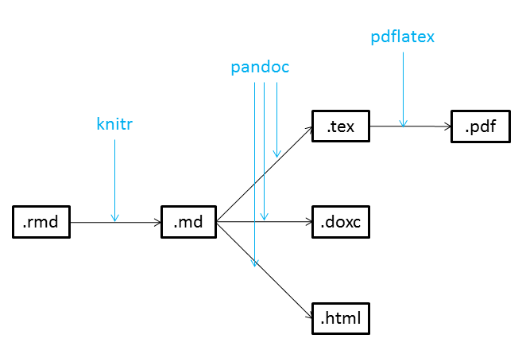
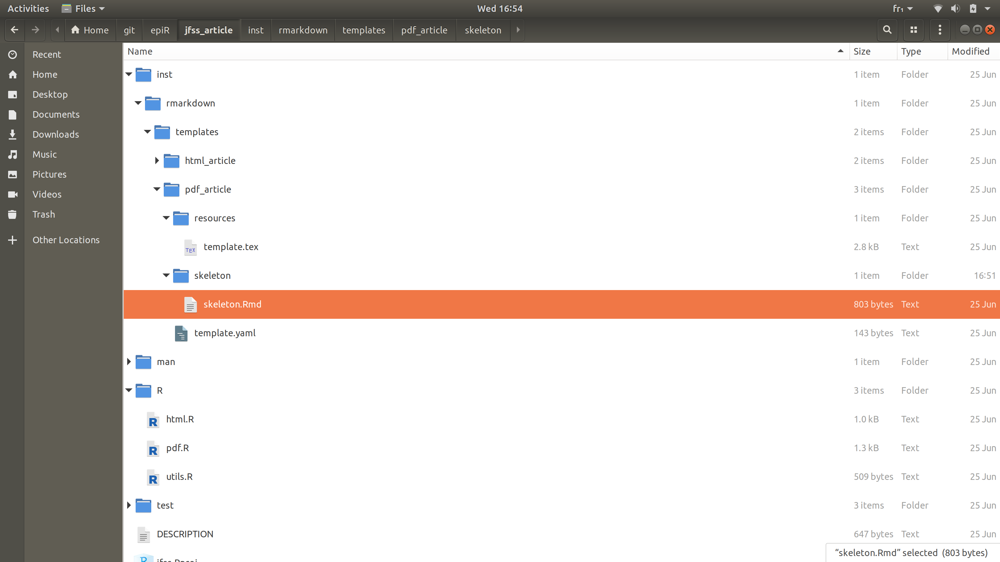

```{r setup, include=FALSE}
knitr::opts_chunk$set(echo = TRUE,  cache = TRUE)
```

# Base de fonctionnement de Rmarkdown

## Résumé de la chaîne de traitement



## Les acteurs

  1. Chaîne de traitement
    - package/fonction *rmarkdown*: gestion de l'ensemble de la chaîne de traitement (Rstudio -> document final)
    - package *knitr*: interprétation du code utilisateur (R/Python/Julia) et conversion en sortie intégrable au document
    - logiciel *Pandoc*: convertisseur de markdown (faiblement structuré)  en langage balisé (fortement structuré)

  2. Interpréteur de langage balisé
    - navigateur web (*HTML*)
    - commande `(pdf)latex` + lecteur  (*PDF*)
    - Word/libreoffice (*docx*)

## Langages

  - Metadata (YAML): paramétrisation de la chaîne de traitement
  - Langage pour code utilisateur (R, Python, Julia, bash...)
  - Langage de balisage (Rmarkdown, markdown, HTML, $\LaTeX2e$, XML)

## Organisation d'un document structuré par balises

   - Un préambule
      - _preamble_ (précède `\begin{document}`) dans $\LaTeX$
      - une _en-tête_ en `HTML` (`<header> ... <\header>`)
   -  document principal
      - `\begin{document} ... \end{document}`  en $\LaTeX$
      - `<body> ... </body>` en `HTML`

## Fichiers

  1. entrée
    - .Rmd (YAML+R+markdown)
  2. fichier intermédiare
    - .md (markdown), figures
  3. configuration
    - .sty, .css
  4. sortie
    - .tex/.PDF, .html, .docx

# Fonctionnement du préambule `Rmd`

L'idée est de transformer le Rmd en md et qu'il soit interprété par pandoc. Les options vont donc devoir être passéees à knitr et à Pandoc. On a donc un préambule pour cela. Néanmoins on voit à ce moment de l'histoire que les options vont être traitées différemment selon les étapes. Il faut donc récupérer les options sous une forme structurée et non plus balisée. C'est le but de *yaml* qui est un parseur. Ceci explique aussi pourquoi l'indentation et la présentation sont importantes. Les éléments parsés vont être transmis aux interpréteurs.

Notez que le type de sortie (`html_document`, `pdf_document`) correspond à une fonction du package `rmarkdown` (`html_document()` ou `pdf_document()`) dont la tâche est d'effectuer toute la chaîne de traitement. Les entrées YAML associé par l'indentitation à cette fonction correspondent en faite à des variables passés en arguments de cette fonction paramétrant le processus.

On peut distinguer les options globales des options qui sont spécifiques d'un format.

## Options globales

Elles sont communes à tout type de sortie

```{yaml}
---
title: titre du document
subtitle: "sous titre"
author: auteur du document
date: "`r Sys.Date()`"
---
```

## Options spécifiques

On peut distinguer pour HTML ou \LaTeX les fichiers de définition inclus (css ou .sty) ou ou l'utilisation de certaines commandes (on donne une valeur à une variable).

### Exemple pour html_document()

```{yaml}
---
title: titre du document
author: auteur du document
output:
  html_document:
    number_sections: yes
    toc: true
    mathjax: "http://example.com/MathJax.js"
    css: monstyle.css
---
```

### Exemple pour pdf_document()

```{yaml}
---
title: titre du document
author: auteur du document
output:
  pdf_document:
    number_sections: yes
    toc: true
    include:
      in_header: preamble.sty
---
```

## Example avancé pour la sortie `beamer_presentation`

[https://github.com/jchiquet/CourseAdvancedR](https://github.com/jchiquet/CourseAdvancedR)

# Créer son propre template `Rmd`

Si la customisation du document est importante il devient vite illisible de les inclure en paramètres dans le préambule et il faut mieux créer son propre template. Ceci revient à créer une libraire R un peu spéciale et l'inclure.

## Exemple: un package pour une publication scientifique

Un exemple simple est le template d'un journal. Il faut créer package  qui s'organisera comme dans la figure suivante :




### Définition d'un processiong de sortie en HTML

Le fichier `html.R` contient la fonction `html_article()` assurant la chaîne de traîtement. Ici, un exemple simple se basant sur la fonction existante `html_document()`

```{r html_article, eval = FALSE}
html_article <- function(...) {

  ## call the base html_document format with the appropriate options
  rmarkdown::html_document(theme = "united",
                            highlight = "tango",
                            toc = TRUE,
                            df_print = "paged",
                            code_folding = "show",
                            code_download = TRUE,
                            toc_float = TRUE,
                            number_sections = TRUE,
                           )
}
```

### Définition d'un processiong de sortie en PDF

Le fichier `pdf.R` contient la fonction `pdf_article()` assurant la chaîne de traîtement. Ici, un exemple simple se basant sur la fonction existante `pdf_document()` et complétant légèrement le processus

```{r pdf_article, eval = FALSE}
pdf_article <- function(...) {

    ## call the base pdf_document format with the appropriate options
    format <- rmarkdown::pdf_document(fig_width = 8, fig_height = 5, fig_crop = TRUE,
                                      dev = 'pdf', highlight = "pygments",
                                      citation_package = "natbib",
                                      template = template_resources("pdf_article", "template.tex"), ...)

    ## create knitr options (ensure opts and hooks are non-null)
    knitr_options <- rmarkdown::knitr_options_pdf(8, 5, TRUE, 'pdf')
    if (is.null(knitr_options$opts_knit))  knitr_options$opts_knit = list()
    if (is.null(knitr_options$knit_hooks)) knitr_options$knit_hooks = list()

    ## set options
    knitr_options$opts_chunk$tidy = TRUE
    knitr_options$opts_knit$width = 45

    ## set hooks for special plot output
    knitr_options$knit_hooks$plot <- function(x, options) {
        knitr::hook_plot_tex(x, options)
    }

    ## override the knitr settings of the base format and return the format
    format$knitr <- knitr_options
    format$inherits <- 'pdf_document'
    format
}
```

### template PANDOC

Le fichier `template.tex` (resp. l'équivalent `style.css`) contient le template pandoc pour la sortie tex (respectivement, HTML)

```{latex }
\documentclass[$if(fontsize)$$fontsize$,$endif$$if(lang)$$lang$,$endif$$if(papersize)$$papersize$,$endif$$for(classoption)$$classoption$$sep$,$endfor$]{$documentclass$}

% ams
\usepackage{amssymb,amsmath}
\usepackage{ifxetex,ifluatex}
\usepackage{fixltx2e}
\usepackage[OT1]{fontenc}
\usepackage[utf8]{inputenc}
\usepackage{eurosym}

% graphix
\usepackage{graphicx}

% url
\usepackage{url}

% hyperref
\usepackage{hyperref}

% units.
\usepackage{units}

$if(lang)$
\ifnum 0\ifxetex 1\fi\ifluatex 1\fi=0 % if pdftex
  \usepackage[shorthands=off,$for(babel-otherlangs)$$babel-otherlangs$,$endfor$main=$babel-lang$]{babel}
$if(babel-newcommands)$
  $babel-newcommands$
$endif$
\else
  \usepackage{polyglossia}
  \setmainlanguage[$polyglossia-lang.options$]{$polyglossia-lang.name$}
$for(polyglossia-otherlangs)$
  \setotherlanguage[$polyglossia-otherlangs.options$]{$polyglossia-otherlangs.name$}
$endfor$
\fi
$endif$

$if(numbersections)$
\setcounter{secnumdepth}{2}
$else$
\setcounter{secnumdepth}{-1}
$endif$

% citations
$if(natbib)$
\usepackage{natbib}
\bibliographystyle{$if(biblio-style)$$biblio-style$$else$plainnat$endif$}
$endif$
$if(biblatex)$
\usepackage{biblatex}
$for(bibliography)$
\addbibresource{$bibliography$}
$endfor$
$endif$

% pandoc syntax highlighting
$if(highlighting-macros)$
$highlighting-macros$
$endif$

% multiplecol
\usepackage{multicol}

% strikeout
\usepackage[normalem]{ulem}

% tightlist macro required by pandoc >= 1.14
\providecommand{\tightlist}{%
  \setlength{\itemsep}{0pt}\setlength{\parskip}{0pt}}

% title / author / date
$if(title)$
\title{$title$}
$endif$
$if(author)$
\author{$for(author)$$author$$sep$ \and $endfor$}
$endif$
$if(date)$
\date{$date$}
$else$
\date{}
$endif$

%% colored links, setting 'borrowed' from RJournal.sty with 'Thanks, Achim!'
\RequirePackage{color}
\definecolor{link}{rgb}{0.1,0.1,0.8} %% blue with some grey
\hypersetup{
  colorlinks,%
  citecolor=link,%
  filecolor=link,%
  linkcolor=link,%
  urlcolor=link
}

$for(header-includes)$
$header-includes$
$endfor$

\begin{document}

$if(title)$
\maketitle
$endif$

$if(abstract)$
\begin{abstract}
\noindent $abstract$
\end{abstract}
$endif$

$for(include-before)$
$include-before$
$endfor$

$if(toc)$
{
$if(colorlinks)$
\hypersetup{linkcolor=$if(toccolor)$$toccolor$$else$black$endif$}
$endif$
\setcounter{tocdepth}{$toc-depth$}
\tableofcontents
}
$endif$
$if(lot)$
\listoftables
$endif$
$if(lof)$
\listoffigures
$endif$

$body$

$if(natbib)$
$if(bibliography)$
$if(biblio-title)$
$if(book-class)$
\renewcommand\bibname{$biblio-title$}
$else$
\renewcommand\refname{$biblio-title$}
$endif$
$endif$
\bibliography{$for(bibliography)$$bibliography$$sep$,$endfor$}

$endif$
$endif$
$if(biblatex)$
\printbibliography$if(biblio-title)$[title=$biblio-title$]$endif$

$endif$

$for(include-after)$
$include-after$
$endfor$

\end{document}
```

### Définition d'un squelette pour l'utilisateur

Le fichier `skeleton.Rmd` contient le squelette du fichier Rmd auquel on accède via l'interface Rstudio lors de la création d'un nouveau document, dont les spécification sont définies dans `teamplate.yml`


