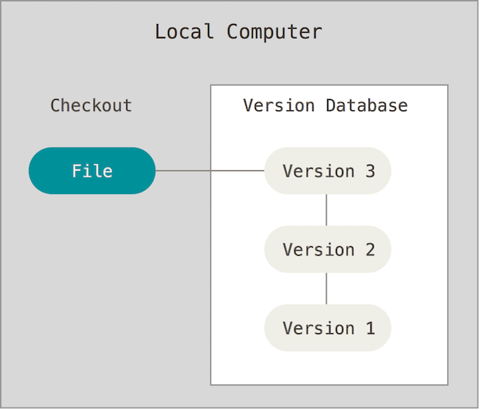

# About Dropbox

- Dropbox versioning is not free.
- Only keep your edits over a period of 30 days.
- Privacy and Security ?
- No differences display.
- The service have the right to delete information from free and inactive accounts.
- Users are not allowed to perform encryption.

# Dropbox shares your data

<a href="https://twitter.com/kopfnuss/status/1020575998205710336">

</a>

# New products based on a git server for collaborating writing.

- ShareLaTeX (https://fr.sharelatex.com)
- Authorea (https://www.authorea.com)
- Overleaf (https://www.overleaf.com)
- PLMLateX (https://plmlatex.math.cnrs.fr/)

# About Version Control

- Records changes to a file or set of files over time.
- You can recall specific versions later.
- You can use it with nearly any type of file on a computer.
- This is the better way to collaborate on the same document.
- Every change is committed with an author and a date.
- Figures are downloaded from [Pro Git book](http://git-scm.com/book).
- "Become a git guru" tutorial (https://www.atlassian.com/git/tutorials).

# Local Version Control Systems

{width=50%}

- One of the most saving popular was a system called RCS
- Available with the Developer Tools with Mac OS X
- Collaboration is not really possible.

# Centralized Version Control Systems

{width=50%}

- Clients check out files from a central place.
- You know what everyone else on the project is doing
- A single server contains all the versioned files.
- For many years, this has been the standard (CVS, SVN).
- You always need network connection.
- If the server is corrupted, with no backup, you lose everything !

# Distributed Version Control Systems

{width=30%}

- Clients fully mirror the repository.
- You can collaborate with different groups of people in different ways simultaneously within the same project.
- No need of network connection.
- Multiple backups.
 

# Configure Git

Install git on windows https://gitforwindows.org

```bash
$ git config --global user.name "Pierre Navaro"
$ git config --global user.email "pierre.navaro@univ-rennes1.fr"
$ git config --global core.editor mvim
$ git config --global merge.tool opendiff
```

```bash
$ git config --list
   user.name=Pierre Navaro
   user.email=pierre.navaro@univ-rennes1.fr
   core.editor=mvim
   merge.tool=opendiff
```

Settings are saved on the computer for all your git repositories.

# Four File status in the repository

{width=50%}

# Initializing a repository in an existing directory

```
$ ls article
	document.tex	figure.png
$ git init
	Initialized empty Git repository in /Users/navaro/article/.git/
$ git status
	On branch master
	Initial commit
	Untracked files:
 	 (use "git add <file>..." to include in what will be committed)

		document.tex
		figure.png

	nothing added to commit but untracked files present
	(use "git add" to track)
```

# Adding files in your repository

```
$ git add document.tex
$ git add figure.png
$ git status
	On branch master
	Initial commit
	Changes to be committed:
 	 (use "git rm --cached <file>..." to unstage)

		new file:   document.tex
		new file:   figure.png

$ git commit -m 'Initial project version'}
	[master (root-commit) 9d23b49] Initial project version
 	2 files changed, 0 insertions(+), 0 deletions(-)
 	create mode 100644 document.tex
 	create mode 100644 figure.png
```


# Cloning a existing repository

```
$ git clone git@github.com:pnavaro/irmar-git-project.git
	Cloning into 'projet'...
	Initialized empty Git repository in /git/repositories/plm/navaro/projet.git/
	warning: You appear to have cloned an empty repository.
	Checking connectivity... done.
```

# Add and commit your files.

```
$ cd sandbox/your_name
$ touch document.tex figure.png
$ git add document.tex figure.png
$ git commit -m 'Add my contribution to the project'
```

Your files are NOT present on the server!

~~~
$ git status
	On branch master
	Your branch is ahead of 'origin/master' by 1 commit.
  	(use "git push" to publish your local commits)
~~~

# Synchronizing your files on the server

By default you are on the "master" branch.

```
$ git branch
	* master
```
Upload your files to the server:

```
$ git push origin master
	...
	To https://github.com/pnavaro/irmar-git-project
   		ae2ce3c..ed796ea  master -> master
```

# Git Workflow
{width=30%}

# Cloning an Existing Directory
Now i change my computer.

```
$ git clone git@github.com:pnavaro/irmar-git-project.git
	Cloning into 'irmar-git-project'...
$ cd irmar-git-project
$ git log
	commit ed796ea1cbd15c8f7ec040b303c950569527012c (HEAD -> master, origin/master, origin/HEAD)
	Author: Pierre Navaro <pierre.navaro@univ-rennes1.fr>
	Date:   Thu Apr 19 13:26:01 2018 +0200

    	Add my contribution to the project
```

# Display and Create a Branch

Display all branches :

```
$ git branch -a
	* master
  		remotes/origin/HEAD -> origin/master
  		remotes/origin/master
```

Create your own branch and switch:

```
$ git branch pierre-branch
$ git checkout pierre-branch
```

Switched to branch 'pierre-branch'

```
$ git branch
  	master
	* pierre-branch
```

Files could be different or non existant between branches but are at the same place on the file system


# Contributing

Modify the file document.tex

```
$ git status
	On branch pierre-branch
	Changes not staged for commit:
 	 (use "git add <file>..." to update what will be committed)
 	 (use "git checkout -- <file>..." to discard changes in working directory)
		modified:   document.tex
	no changes added to commit (use "git add" and/or "git commit -a")

$ git diff
	diff --git a/document.tex b/document.tex
	index a608114..e69de29 100644
	--- a/document.tex
	+++ b/document.tex
	@@ -1,3 +0,0 @@
	-Exemple Git pour la journee de rentree
```

# Locally saving your modifications

```
$ git add document.tex
```
Checking which files are ready to be committed.

```
$ git status
On branch pierre-branch
Changes to be committed:
  (use "git reset HEAD <file>..." to unstage)
	modified:   document.tex
```
Now save your work, the branch is local.

```
$ git commit -m 'Some modifications'
[pierre-branch 8c6bf81] Some modification is available
 1 file changed, 3 insertions(+)
```

# Fast commit

{width=50%}
{width=50%}

Use it carefully!

# Share your work and make it available on the server

## Option 1 : Merge to the main branch and push

```
$ git checkout master

	Switched to branch 'master'
	Your branch is up-to-date with 'origin/master'.

$ git merge pierre-branch

	Updating 7cef21a..8c6bf81
	Fast-forward
 	document.tex | 3 +++
 	1 file changed, 3 insertions(+)

$ git push origin master

	Counting objects: 3, done.
	...
```

# Share your work and make it available on the server

## Option 2 : Push your branch to the server

```
$ git checkout pierre-branch

	Switched to branch 'pierre-branch'

$ git push origin pierre-branch

$ git branch -a
  	master
	* pierre-branch
  	remotes/origin/HEAD -> origin/master
  	remotes/origin/master
  	remotes/origin/pierre-branch
```

# Updating from the Repository

The master branch has changed. To get all new updates :

```git
$ git checkout master     
	Switched to branch 'master'

$ git fetch origin         
	download changes from repository

$ git merge origin/master  
	update local branch master

$ git checkout pierre-branch
	Switched to branch 'pierre-branch'

$ git merge master          
	update your branch
```
If you did not push your branch, use `rebase` instead of `merge`

# Merge conflicts

If you have conflict, no problem just do :

```
$ git mergetool
```

A nice editor helps you to choose the right version. Close and :

```
$ git commit -m 'Update and fixed conflicts'
```

# Git cycle on a single branch

{width=50%}


# Progressive-stability branching

{width=50%}

# Stash
Use itwhen you want to record the current state of the working directory and the index.

- Modify a file in the repository and save it with

```
$ git stash
```
- You can display saved changes with

```
$ git stash show
```

- Apply the modifications with

```
git stash pop (or apply)
```

or drop them with

```
$ git stash drop
```


# Why Git?

- Tracking and controlling changes in the software.
- Branches : Frictionless Context Switching, Role-Based Codelines.
- Everything is local : Git is fast.
- Multiple Backups.
- It's impossible to get anything out of Git other than the exact bits you put in.
- Staging Area : intermediate index between working directory and repository.
- Pull-request is a nice feature for code reviewing and protect the stable branch.

# Why not

- Sometimes confusing for new users coming from CVS or subversion.
- Crazy command line syntax.
- Simple tasks need many commands.
- Git history is often strange.
- It is possible to destroy the repository on the remote server.
- Power for the maintainer, at the expense of the contributor.


# Some useful commands

- Showing which files have changed between git branches

```
$ git diff --name-status master..mybranch
```
- Compare the master version of a file to my current branch version

```
$ git diff mybranch master -- myfile.F90
```

- Remove all ignored files (do it after a commit)

```
$ git clean -xdf
```

- To revert to a previous commit, ignoring any changes:

```
$ git checkout myfile.cpp
$ git reset --hard
```

# Git through IDE

- Install bash-completion and source git-prompt.sh.
- Use Gui tools:
	- [GitHub Desktop](https://desktop.github.com/)
	- [Sourcetree](https://fr.atlassian.com/software/sourcetree)
	- [GitKraken](https://www.gitkraken.com/)
- VCS plugin of IDE
	- [RStudio](https://www.rstudio.com/)
	- [Eclipse](https://www.eclipse.org/downloads/)
	- [TeXstudio](www.texstudio.org/)
	- [JetBrains](https://www.jetbrains.com/)
