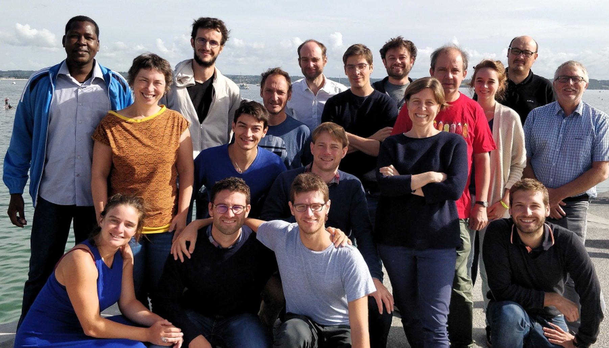

## Où ? Quand ?

Le site agrocampus Ouest de Beg Meil a accueilli du 27 au 31 aoùt 2018, le deuxième R Bootcamp du [groupe State Of The R](https://stateofther.github.io/). 

<iframe src="https://www.google.com/maps/embed?pb=!1m18!1m12!1m3!1d2810.2215386726093!2d-3.987423784420781!3d47.86384657816518!2m3!1f0!2f0!3f0!3m2!1i1024!2i768!4f13.1!3m3!1m2!1s0x4810d0176ae36fe9%3A0x73290fa3b60d0239!2sBeg-Meil!5e1!3m2!1sen!2sfr!4v1536007869899" width="600" height="450" frameborder="0" style="border:0" allowfullscreen></iframe>

## Quoi ?

Cette semaine a été consacrée à l'approfondissement de diverses thématiques (méthodologiques, techniques) autour du logiciel `R`: ce site propose un compte rendu des différents thèmes abordés. Les participants ont tous collaboré au cours d'ateliers organisés en petits groupes à alimenter ce site.

## Qui



### 1er rang

- [Marie Perrot](https://www6.inra.fr/mia-paris/Equipes/Membres/Marie-Perrot-Dockes) (UMR MIA Paris)
- [Timothée Tabouy](https://tabouyt.github.io/) (UMR MIA Paris)
- [Félix Cheysson](Félix Cheysson • Research - Institut Pasteur) (UMR MIA Paris)
- [Mathieu Carmassi](https://mathieucarmassi.github.io/) (UMR MIA Paris - EDF)

### 2ème rang

- [Marie-Pierre Étienne](https://irmar.univ-rennes1.fr/interlocuteurs/marie-pierre-etienne) (IRMAR/ Agrocampus Ouest)
- [Antoine Bichat](https://github.com/abichat) (UMR Maiage - INRA)
- [Julien Chiquet](http://julien.cremeriefamily.info) (UMR MIA Paris - INRA)
- [Sophie Donnet](https://www6.inra.fr/mia-paris/Equipes/Membres/Sophie-Donnet) (UMR MIA Paris - INRA), 

### 3ème rang

- Bewentaoré Sawadogo (UMR MIA Paris)
- [Pierre Gloaguen](https://papayoun.github.io/) (UMR MIA Paris - Agroparistech)
- [Avner Bar-Hen](https://twitter.com/a_bh?lang=en) (CNAM)
- [Saint-Clair Chabert-Liddell](https://www.linkedin.com/in/saint-clair-chabert-liddell-33728b145) (UMR MIA Paris)
- [Vincent Runge](http://www.math-evry.cnrs.fr/members/vrunge/welcome) (UMR LaMME - Université  Paris Saclay)
- [Jean-Baptiste Lecomte](https://www6.rennes.inra.fr/ese/PERSONNELS/Personne_umr/(idpers)/280/(idlang)/) (UMR ESE - Agrocampus Ouest)
- [Gabriel Lang](https://www6.inra.fr/mia-paris/Equipes/Membres/Gabriel-Lang) (UMR MIA Paris - Agroparistech)
- [Raphaëlle Momal](https://www6.inra.fr/mia-paris/Equipes/Membres/Raphaelle-Momal) (UMR MIA Paris)
- [Pierre Navaro](https://irmar.univ-rennes1.fr/interlocuteurs/pierre-navaro) (IRMAR - CNRS)
- [Éric Parent](https://www6.inra.fr/mia-paris/Equipes/Membres/Eric-Parent) (UMR MIA Paris - Agroparistech)

<!-- ## Planning indicatif -->

<!-- ```{r programme, echo = FALSE} -->
<!-- library(tidyr) -->
<!-- library(dplyr) -->
<!-- library(tibble) -->

<!-- programme <- readODS::read.ods(file = '../Programme.ods')[[1]] %>%  -->
<!--   rename(Horaire = A, Lundi = B, Mardi = C, Mercredi = D, Jeudi = E, Vendredi = F) %>%  -->
<!--   filter(!(Horaire == '')) -->

<!-- DT::datatable(programme) %>% DT::formatStyle( columns = colnames(programme)[-1], -->
<!--   backgroundColor = DT::styleEqual(c('','Repas', 'Pause','Atelier 1 : Web scraping/ Textmining', 'Atelier 2 : R Interface', 'Atelier 3 : bonnes pratiques de programmation','Atelier 4 : SIG et représentation graphique', 'Rappel d\'optimisation', 'Package', 'Base de données', 'Atelier 3 : Point P. Navarro','Atelier 1 : Bilan','Atelier 2 : Bilan','Atelier 3 : Bilan','Atelier 4 : Bilan', 'Bilan', 'Finalisation des rendus' ), c('lightgray','#c9dfe8', '#c9dfe8','#def7cf',  '#c3f2a7','#b5f48d','#96e863','#f2fc9c', '#f2fc9c', '#f2fc9c', '#f2fc9c', '#9ceefc', '#9ceefc', '#9ceefc', '#9ceefc', '#9ceefc', '#9ceefc') )) -->
<!-- ``` -->

<!-- Les séquences en vert correspondent à des séances d'atelier en sous groupes. Les séquences en jaune correspondent à un panorama du sujet indiqué, tandis que les séquences en bleu correspondent à des temps de réflexion et rédaction sur le rendu final. -->
